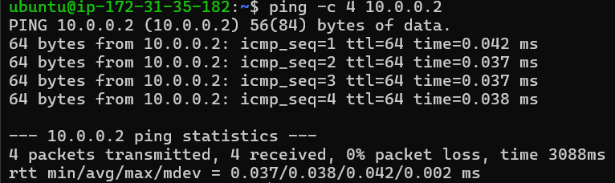
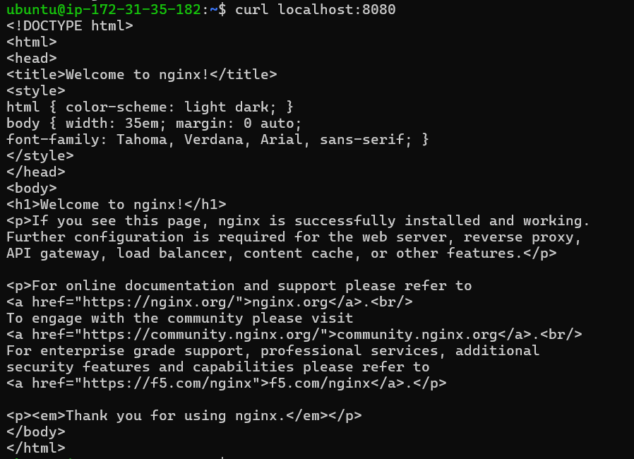
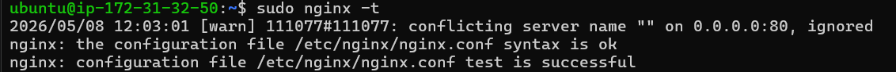
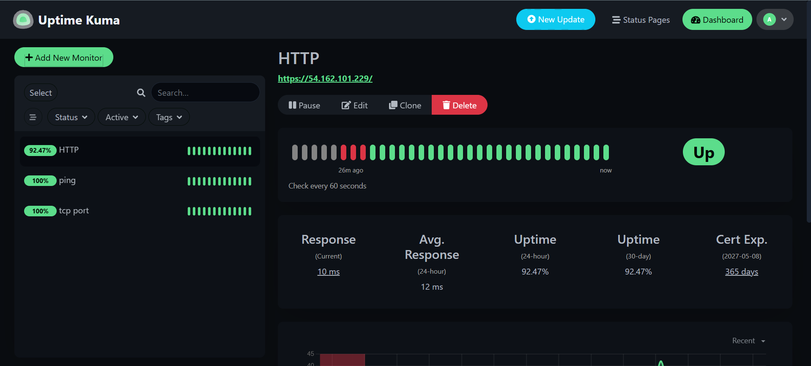

# Mini Zero Trust Architecture (ZTNA) Capstone Lab

## Project Overview

This capstone project demonstrates a simplified Zero Trust Network Architecture (ZTNA) deployment using:

- WireGuard VPN
- Nginx Reverse Proxy
- TLS 1.3 Encryption
- Uptime Kuma Monitoring
- Segmented Backend Infrastructure

The architecture simulates an enterprise-style secure application deployment where traffic flows through a public gateway and reaches private backend services over an encrypted tunnel.

---

# Architecture Diagram

```text
                +-------------------+
                |   Laptop Client   |
                +---------+---------+
                          |
                    HTTPS/TLS 1.3
                          |
                +---------v---------+
                | VM1 Public Gateway|
                |-------------------|
                | Nginx Proxy       |
                | Uptime Kuma       |
                +---------+---------+
                          |
                  WireGuard Tunnel
                          |
                +---------v---------+
                | VM2 Private App   |
                |-------------------|
                | Internal Nginx    |
                +-------------------+
```

---

# Infrastructure Components

| Component | Purpose |
|---|---|
| VM1 | Public gateway server |
| VM2 | Private backend application server |
| WireGuard | Encrypted site-to-site tunnel |
| Nginx | Reverse proxy and TLS gateway |
| Uptime Kuma | Monitoring and uptime dashboard |
| TLS 1.3 | Secure HTTPS communication |

---

# Objective

The goal of this project was to:

- Implement a segmented backend architecture
- Secure traffic using WireGuard VPN
- Configure a reverse proxy gateway
- Enable TLS 1.3 encryption
- Monitor infrastructure health using Uptime Kuma
- Simulate a mini Zero Trust deployment model

---

# Environment Details

## VM1 (Gateway)

| Service | Description |
|---|---|
| Nginx | Reverse proxy gateway |
| Uptime Kuma | Monitoring service |
| Public Access | HTTPS-enabled |

## VM2 (Backend)

| Service | Description |
|---|---|
| Nginx Container | Internal application |
| Private Access Only | Accessible through WireGuard |

---

# Step 1 — WireGuard VPN Setup

WireGuard was configured to establish a secure encrypted tunnel between VM1 and VM2.

## Verification

```bash
sudo wg show
```

## Tunnel Connectivity Test

```bash
ping -c 4 10.0.0.2
```

Successful responses confirmed encrypted connectivity between both virtual machines.





---

# Step 2 — Backend Application Deployment

An internal Nginx container was deployed on VM2.

## Docker Deployment

```bash
docker run -d \
--name internal-app \
-p 8080:80 \
nginx
```

## Local Validation

```bash
curl localhost:8080
```

The application was intentionally kept private and accessible only through the WireGuard tunnel.





---

# Step 3 — Reverse Proxy Configuration

Nginx was configured on VM1 as the public-facing reverse proxy.

## Nginx Configuration

```nginx
server {
    listen 80;
    return 301 https://$host$request_uri;
}

server {
    listen 443 ssl;
    server_name _;

    ssl_certificate /etc/nginx/ssl/capstone.crt;
    ssl_certificate_key /etc/nginx/ssl/capstone.key;

    ssl_protocols TLSv1.2 TLSv1.3;
    ssl_prefer_server_ciphers on;

    location / {
        proxy_pass http://10.0.0.2:8080;

        proxy_set_header Host $host;
        proxy_set_header X-Forwarded-For $remote_addr;
    }
}
```

## Configuration Validation

```bash
sudo nginx -t
```




---

# Step 4 — TLS 1.3 Enablement

Self-signed TLS certificates were generated for HTTPS communication.

## Certificate Generation

```bash
sudo openssl req -x509 -nodes -days 365 \
-newkey rsa:2048 \
-keyout /etc/nginx/ssl/capstone.key \
-out /etc/nginx/ssl/capstone.crt
```

## TLS Verification

```bash
openssl s_client -connect 54.162.101.229:443 -tls1_3
```

## Validation Result

```text
Protocol : TLSv1.3
```

This confirmed that the gateway successfully enforced TLS 1.3 encryption.


---

# Step 5 — Uptime Kuma Monitoring

Uptime Kuma was deployed on VM1 to monitor infrastructure health.

## Deployment

```bash
docker run -d \
--restart=always \
-p 3001:3001 \
--name uptime-kuma \
louislam/uptime-kuma:1
```

## Monitors Configured

| Monitor Type | Target |
|---|---|
| HTTP | https://54.162.101.229 |
| Ping | 10.0.0.2 |
| TCP Port | 10.0.0.2:8080 |





---

# End-to-End Traffic Flow

```text
Laptop Browser
      |
HTTPS/TLS 1.3
      |
VM1 Nginx Gateway
      |
WireGuard Tunnel
      |
VM2 Internal Application
```

This demonstrates a secure segmented architecture where backend services remain isolated from direct public exposure.


---

# Keycloak IAM Integration Attempt

An attempt was made to integrate Keycloak as an Identity and Access Management (IAM) provider.

## Challenges Encountered

The deployment experienced instability due to free-tier infrastructure limitations:

- Low RAM availability
- Limited disk storage
- Java container memory pressure
- Docker image extraction failures

## Troubleshooting Performed

- Swap memory provisioning
- JVM memory optimization
- Docker cleanup procedures
- Disk space recovery
- Lightweight container tuning

Although the deployment was not stable enough for production-style operation on the available infrastructure, the troubleshooting process provided valuable operational and DevOps experience.

---


# Reflection — Mapping the Mini-ZTNA Lab to Real InstaSafe Architecture

This capstone project implemented a simplified Zero Trust Network Architecture (ZTNA) using WireGuard, Nginx, TLS 1.3, Docker, and monitoring tools. Although the deployment was intentionally lightweight and designed for educational purposes, it closely reflects several core concepts used in real enterprise Zero Trust platforms such as InstaSafe.

The architecture used in this project consisted of a public-facing gateway server, a private backend application server, and an encrypted WireGuard tunnel connecting both systems. The public gateway handled HTTPS traffic and reverse proxying, while the backend application remained isolated from direct internet exposure. This mirrors how enterprise ZTNA products protect internal resources by routing traffic through secure gateways instead of exposing applications publicly.

The WireGuard VPN tunnel in this project simulated the encrypted communication channel used between secure gateways and internal services in enterprise environments. In real deployments, InstaSafe provides secure identity-aware access to applications without requiring full network exposure. The reverse proxy implemented using Nginx represented the access gateway component that receives user traffic and forwards authenticated requests to protected backend applications.

TLS 1.3 encryption was also implemented in the lab to secure external communication. This aligns with real-world security requirements where modern encryption standards are mandatory for protecting user sessions and application traffic. Enabling TLS 1.3 provided practical experience with HTTPS configuration, certificate generation, and secure transport mechanisms.

Monitoring through Uptime Kuma simulated the observability and health monitoring components present in enterprise infrastructures. Production ZTNA solutions require constant monitoring of gateways, endpoints, tunnels, and applications to ensure service availability and security visibility. While Uptime Kuma is a lightweight monitoring solution, it demonstrated the importance of infrastructure observability.

The project also included an attempted integration of Keycloak as an Identity and Access Management (IAM) provider. Although the deployment faced limitations due to restricted free-tier infrastructure resources, the process demonstrated how identity systems are integrated into Zero Trust architectures. Real InstaSafe deployments heavily rely on identity-aware access control mechanisms, Single Sign-On (SSO), and centralized authentication providers.

However, compared to a real production-grade InstaSafe deployment, this mini-ZTNA architecture is still significantly simplified. Several advanced enterprise features are missing from the implementation. Multi-factor authentication (MFA), role-based access control (RBAC), device posture validation, adaptive access policies, centralized logging, SIEM integration, high availability, auto-scaling, load balancing, and cloud-native orchestration were not implemented in this project.

Additionally, the infrastructure in this capstone relied on small free-tier virtual machines, which introduced limitations related to RAM, storage, and container stability. Enterprise-grade deployments would use scalable cloud infrastructure, managed Kubernetes clusters, production certificate authorities, automated CI/CD pipelines, and redundant failover systems.

Despite these limitations, this project successfully demonstrated the foundational concepts behind Zero Trust architecture. It provided hands-on experience with encrypted tunnels, reverse proxying, TLS security, monitoring, infrastructure troubleshooting, and segmented backend design. The troubleshooting process itself — including resource optimization, swap provisioning, Docker cleanup, and service debugging — provided valuable operational experience relevant to real-world DevOps and cybersecurity environments.

Overall, this capstone successfully simulated the core principles of a Zero Trust deployment while providing practical exposure to infrastructure security concepts used in modern enterprise environments such as InstaSafe.


# Conclusion

This project successfully implemented a mini Zero Trust-inspired architecture using encrypted tunnels, reverse proxying, TLS encryption, and monitoring tools.

The deployment demonstrates practical cloud infrastructure skills and production-style troubleshooting workflows relevant to modern DevOps and cybersecurity environments.

