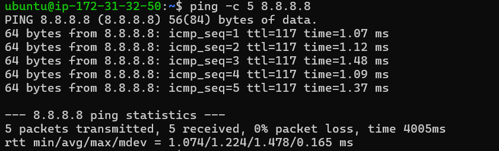
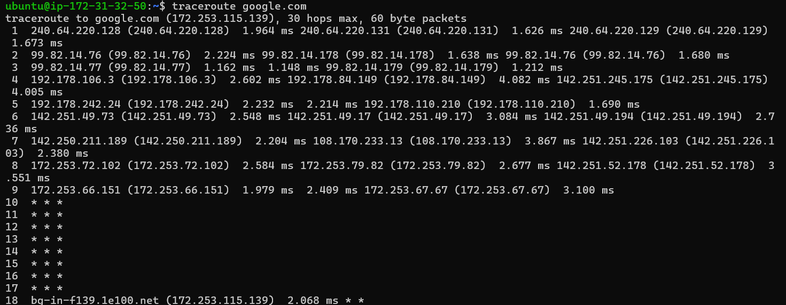
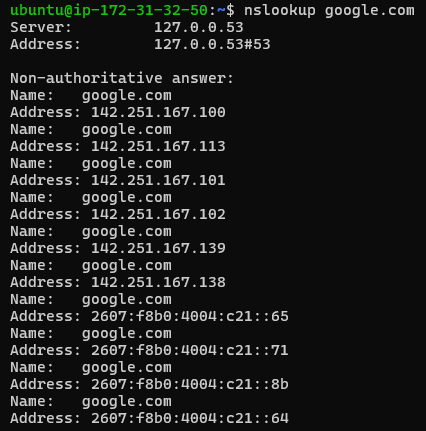
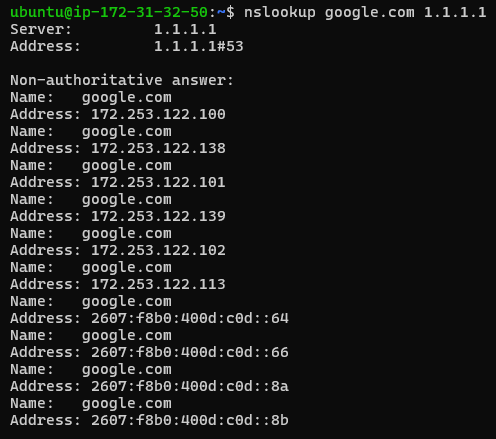
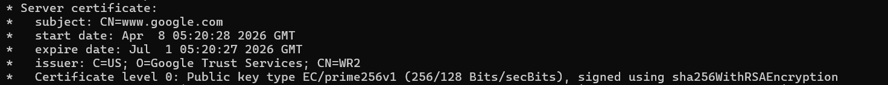

# lab1-1-findings.md
# Lab 1.1 Findings
**Author:** Antariksh Mohapatra
**Date:** May 6, 2026

## My VM Details
- **Provider:** AWS
- **Region:** us-east-1 (North Virginia)
- **OS:** Ubuntu 26.04 LTS

## Experiment Results

### Ping to 8.8.8.8
- **Average RTT:** 1.224 ms
- **TTL value observed:** 117
- **What does TTL tell us about the path?** TTL (Time to Live) is a mechanism that limits the lifespan of data in a network to prevent infinite loops. Each router the packet crosses decrements the TTL by 1. A value of 117 suggests the packet started at a standard base (like 128) and passed through roughly 11 hops before reaching its destination.

### Traceroute to google.com
- **Number of hops:** 18
- **Any * * * hops? At which hop number?** Yes, hops 10 through 17 showed `* * *` timeouts. This indicates that those specific routers are configured to prioritize forwarding traffic over responding to ICMP diagnostic requests (Traceroute), likely for security or resource management.

### DNS Comparison
- **Result from default DNS:** 142.251.167.100
- **Result from 1.1.1.1:** 172.253.122.100
- **Are they different? Why might they differ?** Yes, they are different. DNS providers use Anycast and geo-routing to return the IP address of the edge server that is geographically or logically closest to the requester to reduce latency.

### google.com TLS Certificate
- **Issuer:** Google Trust Services, CN=WR2
- **Expiry date:** July 1, 2026
- **TLS version used:** TLSv1.3

