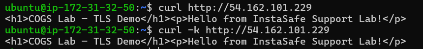
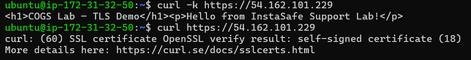
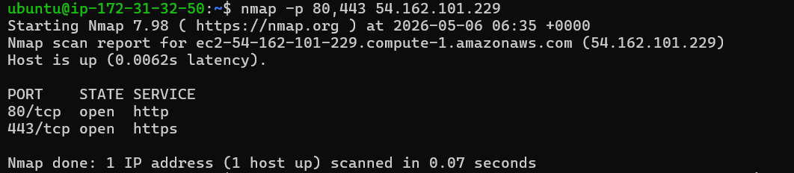
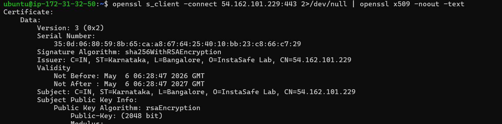

# Lab 1.2 Findings: Web Guardian
**Author:** Antariksh Mohapatra
**Date:** May 6, 2026

---

## 1. Nginx Service Verification
To confirm Nginx is serving both HTTP and HTTPS traffic, I executed `curl` commands for both protocols.

- **HTTP Request:** `curl http://54.162.101.229`
- **HTTPS Request:** `curl -k https://54.162.101.229`

---

## 2. Firewall Configuration
The AWS Security Group rules were modified to allow inbound traffic on Port 80 and Port 443. The following `nmap` output verifies the firewall is correctly configured.

- **Command:** `nmap -p 80,443 54.162.101.229`
- **Port 80/tcp:** `open`
- **Port 443/tcp:** `open`

---

## 3. TLS Certificate Analysis
Using `openssl s_client -connect 54.162.101.229:443`, I extracted the following certificate details:

| Field | Details |
| :--- | :--- |
| **Subject** | C=IN, ST=Karnataka, L=Bangalore, O=InstaSafe Lab, CN=54.162.101.229 |
| **Issuer** | C=IN, ST=Karnataka, L=Bangalore, O=InstaSafe Lab, CN=54.162.101.229 |
| **Key Algorithm** | RSA 2048-bit |
| **Expiry Date** | May 6 06:28:47 2027 GMT |

---

## 4. Technical Explanation
**Question:** Why does `curl` without `-k` fail? What would need to change to make it succeed?

**Answer:** 
The `curl` command fails without the `-k` (insecure) flag because the certificate presented by the server is **self-signed**. Since this certificate was not issued by a globally recognized Certificate Authority (CA) found in the system's trust store, `curl` cannot verify the "Chain of Trust" and aborts the connection for safety.

To make the connection succeed without `-k`, one of two things would need to change:
1. **Use a Trusted CA:** The server would need a certificate issued by a provider like Let's Encrypt or DigiCert.
2. **Local Trust:** The client (my laptop) would need to manually import the server's `.crt` file into its local Trusted Root Certification Authorities store.
