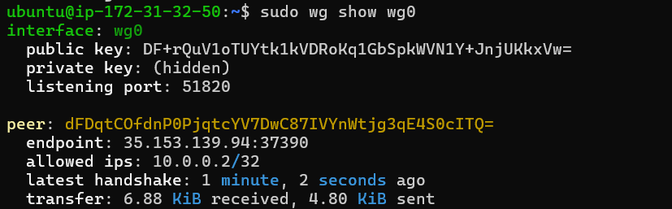
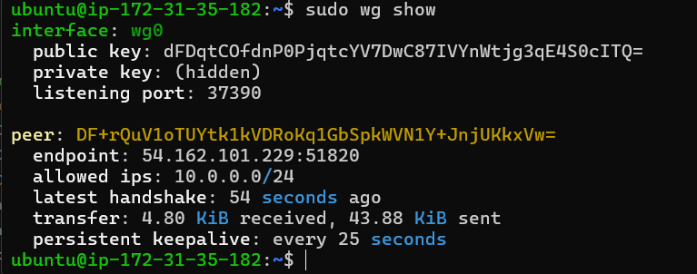
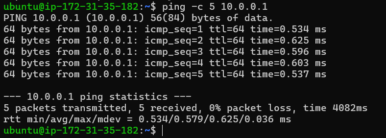
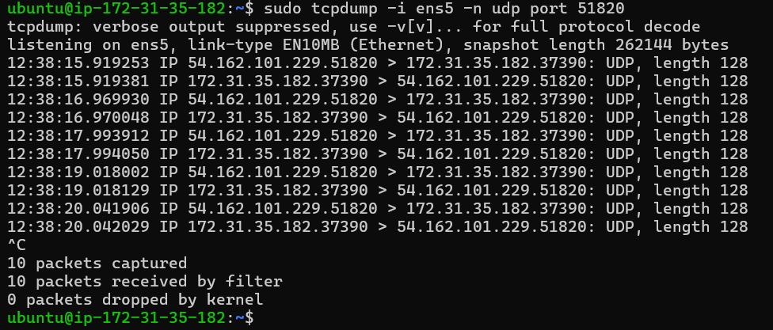

# Lab 1.3 Findings: WireGuard VPN
**Author:** Antariksh Mohapatra
**Date:** May 6, 2026

---

## 1. ZTNA Component Mapping
WireGuard provides a simplified, open-source model of how enterprise Zero Trust Network Access (ZTNA) operates. Based on the architecture built in this lab, here is how the WireGuard components map directly to the InstaSafe ZTNA architecture:

*   **WireGuard Client (VM2):** This maps to the **InstaSafe Agent**. It resides on the end-user's machine and initiates the secure connection.
*   **WireGuard Server (VM1):** This maps to the **InstaSafe Gateway**. It acts as the secure enforcement point that listens for incoming agent connections and routes them to internal resources.
*   **Encrypted UDP Tunnel:** This maps directly to the secure **Point-to-Point Data Tunnel** established between the user's Agent and the Gateway, ensuring traffic cannot be intercepted.
*   **Public/Private Key Pairs:** These act as the **InstaSafe Controller and Certificates**. The exchange of public keys handles the identity verification and authorization phase, ensuring only trusted devices can establish the tunnel.

---

## 2. Infrastructure Notes & Troubleshooting
- **Cloud Provider:** AWS (EC2)
- **Networking:** Overcame a routing issue by explicitly opening UDP port 51820 in the AWS Security Group, which is required because WireGuard relies entirely on connectionless UDP traffic.
- **Packet Capture:** The default interface `eth0` was not present on the AWS Ubuntu instance. The capture was successfully executed by identifying the correct active network interface (`ens5`) using the `ip a` command.

---

## 3. Evidence for Grading
The following screenshots prove the tunnel's functionality and end-to-end encryption:

### 3.1 Handshake Verification
*Screenshot of `sudo wg show` on both VMs displaying the active public keys, listening ports, and the `latest handshake` timestamp.*

### 3.2 Tunnel Connectivity
*Screenshot of `ping 10.0.0.1` succeeding from the VM2 client, proving traffic is routing exclusively through the `wg0` interface.*

### 3.3 Encryption Proof
*Screenshot of `sudo tcpdump -i ens5 -n udp port 51820` showing encrypted, unreadable packet payloads while a ping was active.*

