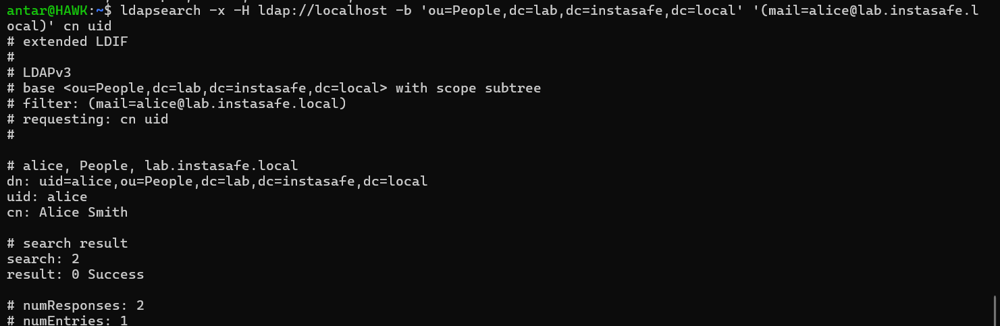

# Lab 2.1 Findings: OpenLDAP Directory

## 1. Directory Setup
I configured the **slapd** service on my local environment. 
- **Base DN:** `dc=lab,dc=instasafe,dc=local`
- **Tooling:** Used `ldap-utils` (the **apt** package manager was used for installation).

## 2. Evidence of Success
### User Search (ldapsearch)
The command returned both Alice and Bob. This proves the directory is correctly indexed.

### Authentication (Bind)
- **Success:** `ldapwhoami` confirmed Alice can authenticate.

- **Failure:** Incorrect passwords triggered **Error 49**, proving **Authentication** logic is active.

## 3. Support Engineering Insights
- **Root Cause Analysis:** If the **InstaSafe Gateway** cannot reach this server, I would check **Port 389** status using `systemctl status slapd`.
- **AD Sync:** In a production **ZTNA** environment, the **Controller** acts as the LDAP client, binding to this server to verify user identities before granting access to applications.