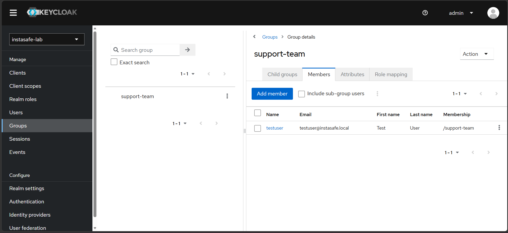
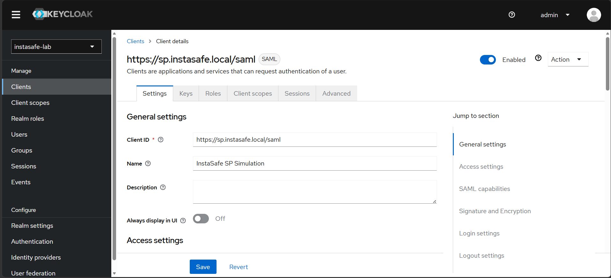
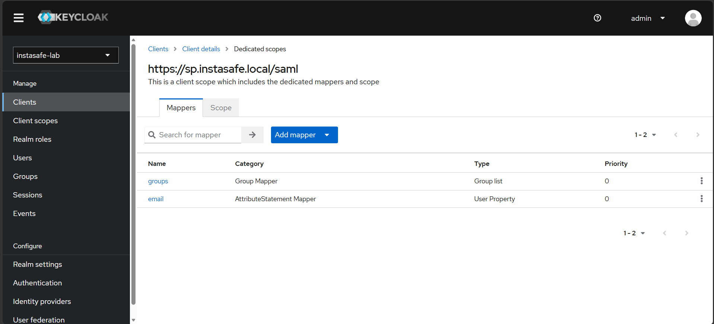
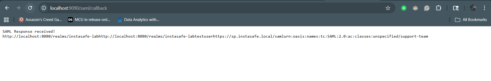

# Lab 2.2: SAML 2.0 Identity Provider Configuration & Integration
**Author:** Antariksh Mohapatra
**Date:** 5 May 2026
**Module:** Identity and Access Management (InstaSafe Lab)

## 1. Objective
The objective of this lab was to deploy and configure Keycloak as a SAML 2.0 Identity Provider (IdP) and successfully establish a secure Single Sign-On (SSO) federation with a custom Python Flask Service Provider (SP). This included configuring realms, users, clients, and attribute mappers to pass authorization data securely.

## 2. Evidence of Completion (Screenshots)

### 2.1 Keycloak Realm & Admin Console
*Demonstrating Keycloak running with the `instasafe-lab` realm active.*

### 2.2 SAML Client Configuration
*Demonstrating the client settings, confirming the SAML protocol type and matching Client ID (`https://sp.instasafe.local/saml`).*

### 2.3 Attribute Mappers Configuration
*Demonstrating the configuration mapping internal user emails and group memberships to SAML assertion attributes.*

### 2.4 IdP Metadata XML
*Screenshot demonstrating the downloaded Keycloak IdP metadata XML used by the Service Provider to verify signatures.*

*(The raw XML snippet can be found in the lab repository).*

---

## 3. Technical Explanations & Troubleshooting

### 3.1 Attribute Mapper Explanation
In a SAML SSO flow, the Identity Provider (Keycloak) authenticates the user, but the Service Provider (the Python app) needs to know *who* logged in and *what* they are allowed to do. 

Attribute mappers act as translators. They take Keycloak's internal user data (like a user's email address or their `support-team` group membership) and package them into standardized XML `<saml:Attribute>` tags inside the SAML Assertion. Without these mappers, the Service Provider would only know a login occurred, but would lack the contextual data needed to enforce Role-Based Access Control (RBAC) or load the correct user profile.

### 3.2 SSO Troubleshooting Scenario
**Question:** "If a customer reports SSO users get Attribute Error, what in this Keycloak config would you check first?"

**Answer:**
If a Service Provider application throws an "Attribute Error" after a successful login, it means the SAML Assertion was delivered, but it was missing the specific data points (like `email`, `role`, or `firstName`) that the application requires to map the user's session. 

To troubleshoot this in Keycloak, I would immediately check the **Client Scopes / Mappers** configuration to ensure the data is actually being injected into the assertion.

**Specific Menu Path to Check:**
1. Log into the Keycloak Admin Console.
2. Select the correct Realm from the top-left dropdown (e.g., `instasafe-lab`).
3. Navigate to **Clients** in the left sidebar.
4. Select the specific SAML Client (e.g., `https://sp.instasafe.local/saml`).
5. Go to the **Client scopes** tab.
6. Click on the dedicated scope for that client (usually named `<client-id>-dedicated`).
7. Click on the **Mappers** tab.
   * *Validation 1:* Ensure the required mappers (e.g., User Property for `email`, or Group list) exist.
   * *Validation 2:* Check the **SAML Attribute Name** inside the mapper settings. If Keycloak is sending the attribute as `User.Email` but the Service Provider expects `urn:oid:0.9.2342.19200300.100.1.3` or just `email`, the SP will throw an attribute error.