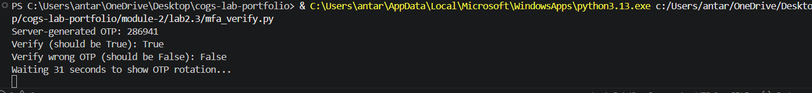
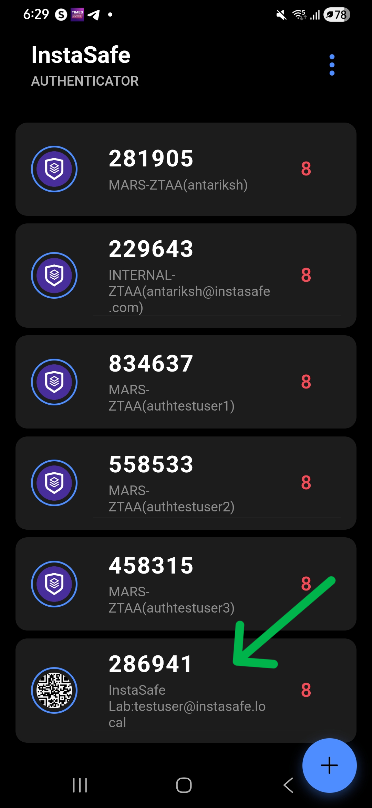
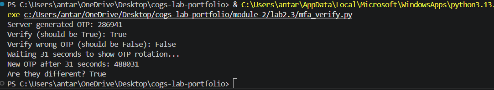

# Lab 2.3: Multi-Factor Authentication (TOTP) Implementation
**Author:** Antariksh Mohapatra
**Date:** 5 May 2026
**Module:** Identity and Access Management (InstaSafe Lab)

## 1. Objective
The objective of this lab was to build and verify a Time-based One-Time Password (TOTP) system from scratch. This experiment demonstrates the mechanics of standardized MFA (RFC 6238) and illustrates why TOTP provides a higher security posture than traditional SMS-based OTPs by eliminating network-based interception risks.

## 2. Evidence of Success

### 2.1 MFA Enrollment (QR Code)
*The generated base32 secret was encoded into a provisioning URI and rendered as a QR code for authenticator app enrollment.*

### 2.2 Synchronized Authentication
*Side-by-side verification showing the Python script's generated OTP matching the live code on the mobile authenticator app.*

### 2.3 Time-Rotation Demonstration
*Proof that the TOTP rotates every 30 seconds. The script captured one code, waited 31 seconds, and successfully generated a new, unique code.*

---

## 3. Technical Analysis & Troubleshooting

### 3.1 TOTP vs. SMS OTP
Unlike SMS OTPs, which are susceptible to SIM swapping and SS7 interception, TOTP relies on a "Shared Secret" and "Time Synchronization." Because the code is generated locally on the device, no sensitive authentication data travels over the cellular network during the login challenge.

### 3.2 Enterprise Troubleshooting: TOTP Failures
**Question:** What causes TOTP failure in an enterprise? List 3 root causes and 1 diagnostic step each.

**Answer:**

1. **Root Cause: Time Drift**
   * **Description:** The TOTP algorithm is strictly time-dependent. If the user's phone clock or the authentication server's clock is off by more than 30-60 seconds, the generated codes will not match.
   * **Diagnostic Step:** Compare the system time on the server with a reliable NTP source and ensure the user's mobile device is set to "Set Time Automatically."

2. **Root Cause: Secret Mismatch**
   * **Description:** The shared secret stored in the Identity Provider (IdP) does not match the secret stored in the user's authenticator app. This usually happens if a user tries to re-enroll but fails to delete the old account from their app.
   * **Diagnostic Step:** Delete the existing account from the authenticator app and trigger a fresh "Reset MFA" for the user in the admin console to generate a new QR code.

3. **Root Cause: Algorithm Configuration Mismatch**
   * **Description:** The Service Provider (SP) and IdP are using different parameters, such as the hashing algorithm (SHA-1 vs. SHA-256) or the time step (30s vs. 60s).
   * **Diagnostic Step:** Review the IdP metadata or configuration settings to ensure the TOTP parameters match the requirements of the application's authentication engine.