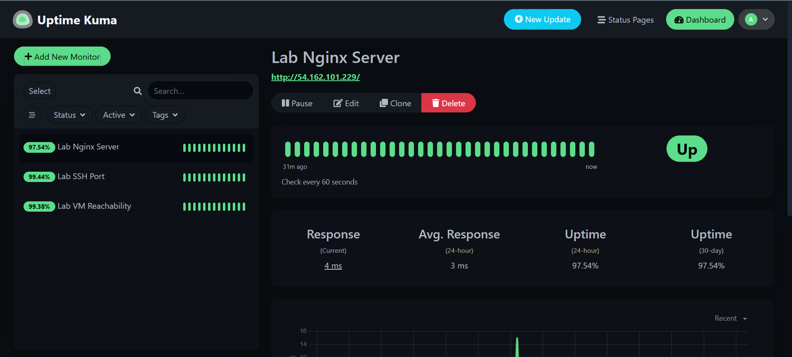
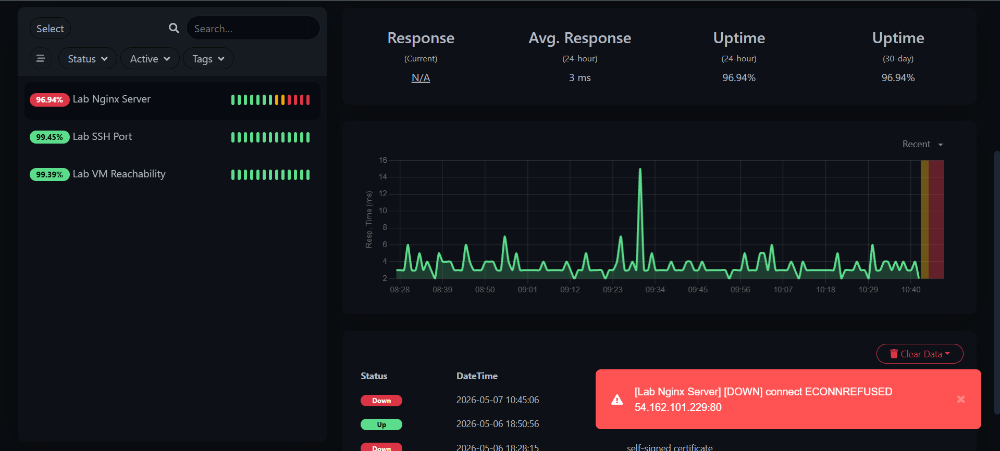
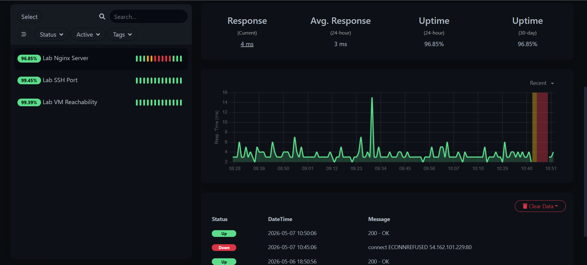

# Lab 3.1 Findings: Uptime Guardian
**Author:** Antariksh Mohapatra
**Date:** May 7, 2026

---

## 1. Monitor Type Mapping
In this lab, I deployed Uptime Kuma to simulate enterprise monitoring. Below is the mapping of the monitor types used in this lab to their equivalents in **Site24x7**, as used in production environments

| Uptime Kuma Type | Site24x7 Equivalent | Lab Use Case |
| :--- | :--- | :--- |
| **HTTP(S)** | Website Monitor | Monitoring the Nginx web server |
| **TCP Port** | Port Monitor | Monitoring SSH availability on Port 22 |
| **Ping** | ICMP/Ping Monitor | Monitoring basic VM reachability |

---

## 2. Technical Analysis
**Question:** Which monitor type would you use to monitor an InstaSafe Gateway?

**Answer:** To monitor an **InstaSafe Gateway**, I would primarily use a **TCP Port Monitor** configured for the specific tunnel port (such as UDP 51820 for WireGuard) and an **HTTP(S) Monitor** to track the health-check endpoint of the gateway application. This ensures the service is not only reachable over the network but is actively processing application requests.

* **Monitor Dashboard (Healthy):** 

* **Incident Alert (Nginx Down):** 

* **Recovery Timeline:** 

---

## 3. Conclusion
I have successfully demonstrated the ability to detect, investigate, and verify the recovery of a service failure using Uptime Kuma. This simulates the real-world alert escalation process handled by support engineers during live shifts.