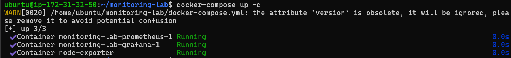
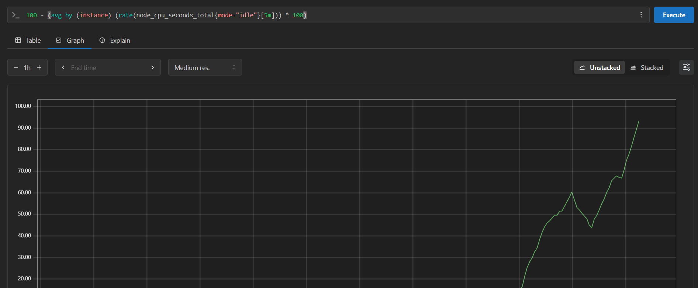
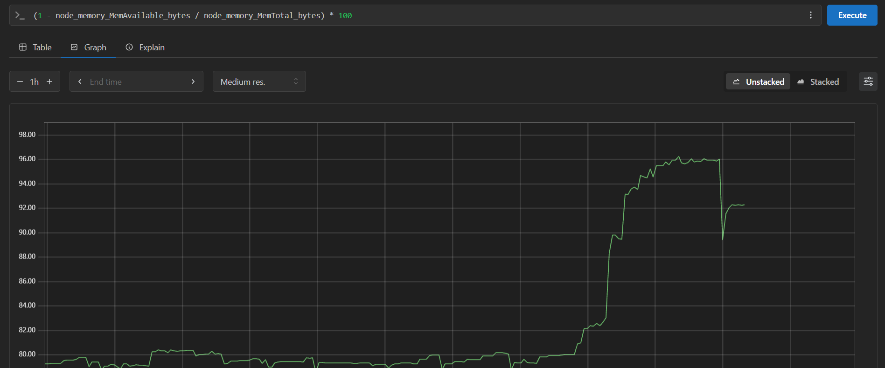
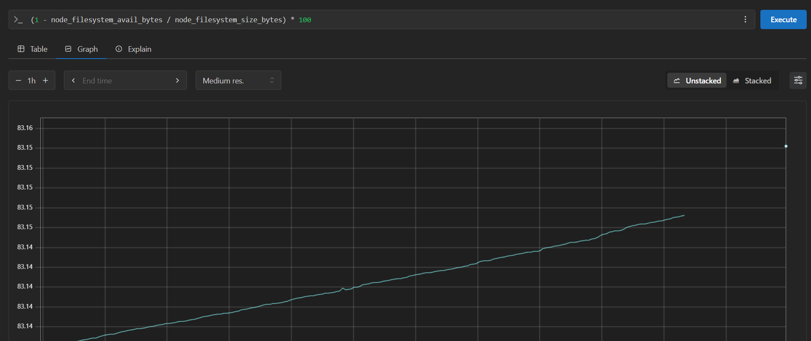
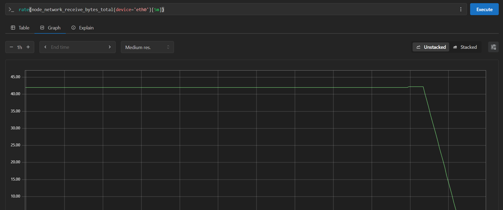
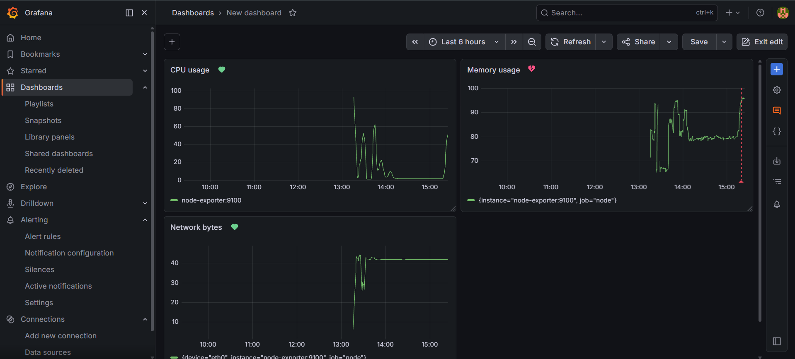

# Lab 3.2 Findings: Prometheus & Grafana
**Author:** Antariksh Mohapatra
**Date:** May 7, 2026

---

## 1. Container Status Check
All monitoring services are successfully deployed and running in a healthy state.

---

## 2. Prometheus Metrics & Queries 
I have configured Prometheus to track four key infrastructure metrics. Each query is returning live data from the Node Exporter:

1. **CPU Usage:** `100 - (avg by (instance) (rate(node_cpu_seconds_total{mode="idle"}[5m])) * 100)`

2. **Memory Usage:** `(1 - node_memory_MemAvailable_bytes / node_memory_MemTotal_bytes) * 100`

3. **Disk Usage:** `(1 - node_filesystem_avail_bytes / node_filesystem_size_bytes) * 100`

4. **Network Traffic (Receive):** `rate(node_network_receive_bytes_total{device='eth0'}[5m])`

---

## 3. Grafana Dashboard 
I built a professional dashboard with 3 panels (CPU, RAM, and Disk) to provide at-a-glance infrastructure health.

---

## 4. Analysis: Prometheus/Grafana vs. SigNoz 

**Question:** What is the difference between what Prometheus/Grafana shows and what SigNoz shows? When would you use each during a P1 incident?

**Answer:**
Prometheus and Grafana focus on **Infrastructure Monitoring**. They track system-level vitals like CPU, RAM, and Disk health. **SigNoz** is an **Application Performance Monitoring (APM)** tool that focuses on distributed traces, request latency, and code-level errors.

**During a P1 Incident:**
* I would use **Prometheus/Grafana** first to see if the entire server is down, out of memory, or if the disk is 100% full (Infrastructure failure).
* I would use **SigNoz** if the infrastructure looks healthy but users are still experiencing errors or slowness. SigNoz helps me trace the specific microservice or database query that is failing within the application code.