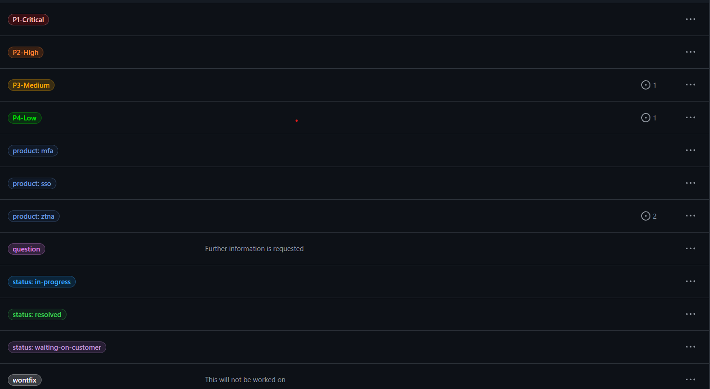
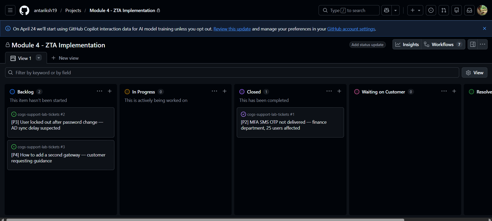
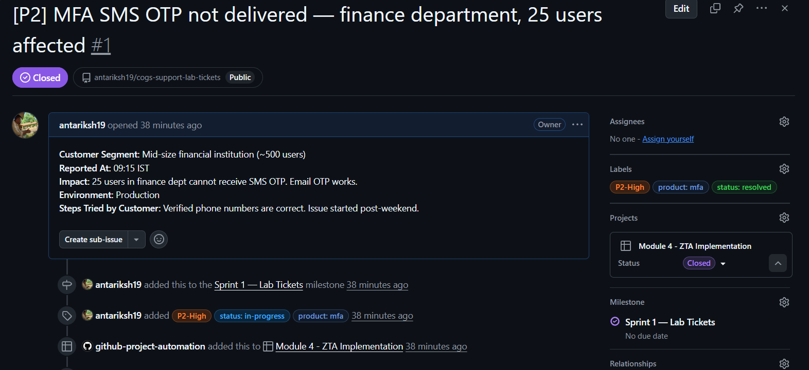
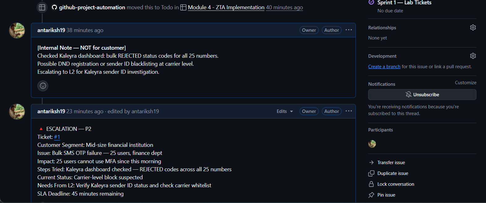
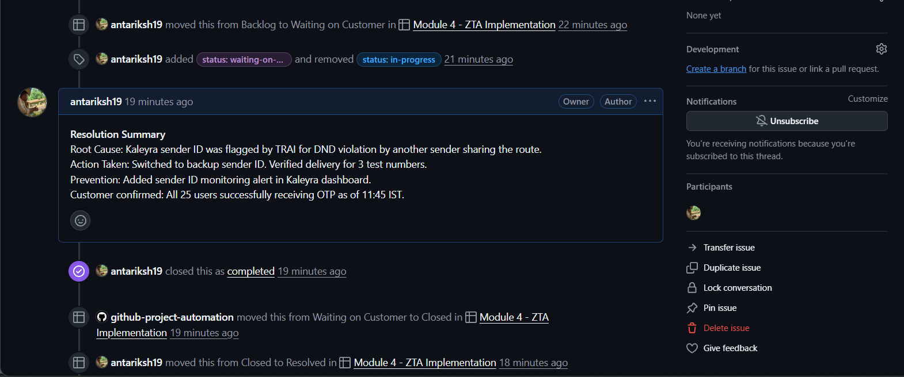
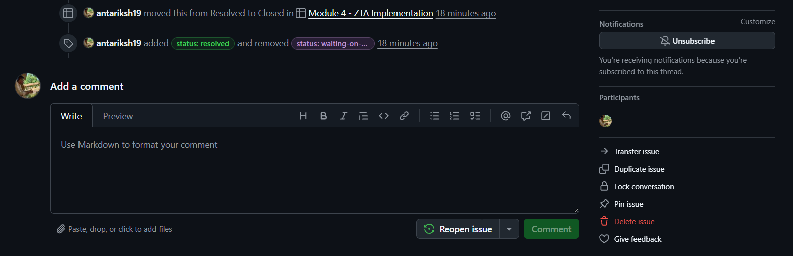

# Lab 4.1 Findings: GitHub Support Desk
**Author:** Antariksh Mohapatra
**Date:** May 7, 2026

---

## 1. Ticketing Infrastructure 
I have successfully configured the `cogs-support-lab-tickets` repository to function as a professional support desk. This included setting up custom labels for priority, status, and product categorization, as well as a Milestone for sprint tracking.

* **Labels Configured:** 10 total labels with specific hex codes for high visibility (P1-P4, statuses, and products).
* **Project Board:** Implemented a Board view with columns: Backlog | In Progress | Waiting on Customer | Resolved | Closed.

---

## 2. Mock Ticket Creation
Three tickets were created to simulate a real-world support backlog. Each ticket followed a structured template to ensure technical context—such as customer segment, impact, and environment was captured accurately.

1. **Ticket 1 (P2):** MFA SMS OTP failure affecting 25 users in a financial institution.
2. **Ticket 2 (P3):** User locked out after password change, suspected AD sync delay.
3. **Ticket 3 (P4):** General guidance on adding a second ZTNA gateway.

---

## 3. Full Ticket Lifecycle Simulation 
I executed the complete support lifecycle for **Ticket 1** to demonstrate professional incident handling and escalation procedures.

* **Triage:** Added an internal investigation note identifying bulk REJECTED status codes in the Kaleyra dashboard.
* **Escalation:** Followed the standard escalation template to notify L2/L3 engineers of a suspected carrier-level block.
* **Resolution:** Documented the root cause (DND violation) and verified the fix with the customer before closure.
* **Hygiene:** Moved the ticket through the "Waiting on Customer" and "Resolved" statuses to maintain an accurate audit trail.

---

## 4. Reflection
Using GitHub Issues simulates professional tools like Zoho Desk. This lab reinforced the importance of the "Never Trust, Always Verify" model by ensuring specific application access and maintaining a documented security trail for every incident.