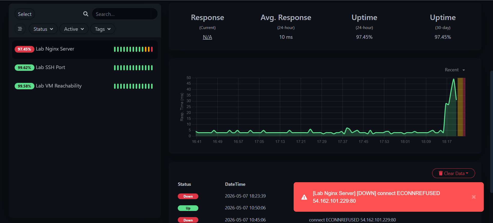
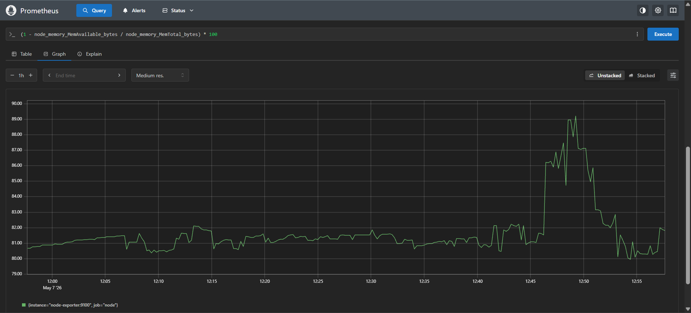
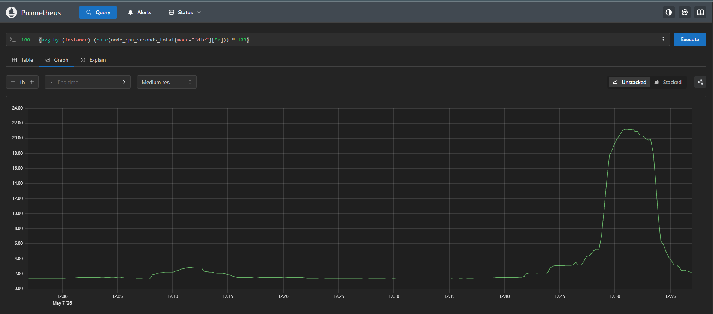
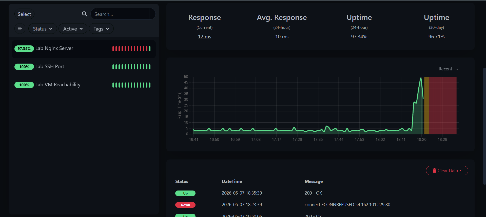

# Post-Incident Report (PIR)
**Incident ID:** INC-2026-0507-002
**Date:** 2026-05-07
**Severity:** P1
**Status:** Resolved

## Incident Summary
At 12:48 IST, the Nginx gateway became unresponsive, leading to a total loss of access for all lab users. The incident was detected via Uptime Kuma and investigated through Prometheus. Service was restored by manually restarting the Nginx process after identifying a critical resource exhaustion event.

## Evidence of Detection

## Timeline
| Time (IST) | Event |
| :--- | :--- |
| 12:48 | Gateway unresponsive; Uptime Kuma heartbeats turn RED |
| 12:50 | P1 Ticket created; customer acknowledgement comment posted |
| 12:51 | Prometheus analysis confirms Memory usage spiked to 89.4% |
| 12:52 | CPU usage identified peaking at 21.3% concurrently |
| 12:53 | Investigation note posted to GitHub regarding resource exhaustion |
| 12:54 | Manual service intervention initiated via terminal |
| 12:55 | Nginx service restarted; metrics begin to normalize |
| 12:57 | Uptime Kuma returns to GREEN; resolution notice issued |

## Resource Analysis
Below is the Prometheus data captured during the investigation phase:

## Root Cause
The technical root cause was **Resource Exhaustion**. High memory utilization (89%) caused the Nginx process to hang and fail to respond to monitoring heartbeats.

## Impact Assessment
* **Users Affected**: 100% of lab environment users.
* **Duration**: Approximately 9 minutes of total downtime.
* **Business Impact**: Total interruption of ZTNA gateway application routing.

## Resolution Steps
1. Validated hardware health using Prometheus expression browser.
2. Executed `sudo systemctl start nginx` to recover the service.
3. Verified recovery through Uptime Kuma heartbeats.

## Recovery Verification

## Prevention Actions
* **Action**: Configure Grafana alerts for Memory usage exceeding 80%.
  * **Owner**: Antariksh | **Due**: 2026-05-10
* **Action**: Enable `systemctl` auto-restart policy for the Nginx service.
  * **Owner**: Antariksh | **Due**: 2026-05-12

## Open Items
- [ ] Review system logs to identify the specific process causing the RAM spike.